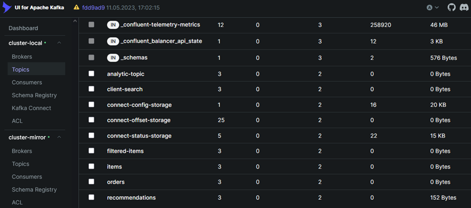

# Финальный проект
- Разработка MVP аналитической платформы для маркетплейса

## Цели
- Создайте источники данных
- Разверните Apache Kafka и настройте топики
- Разработайте аналитическую систему
- Реализуйте потоковую обработку данных
- Настройте систему для хранения и поиска данных
- Настройте мониторинг Kafka
- Оформите документацию

## Структура проекта
- `docker-compose-ssl.yaml`: Основная конфигурации сервисов Kafka с использованием SASL_SSL.
- `docker-compose-monitor.yaml`: Конфигурация мониторинга инфраструктуры Kafka.
- `docker-compose-jupyter.yaml`: Конфигурация юпитера и сервиса kafka_to_hdfs.
- `docker-compose-client.yaml`: Конфигурация сервиса client api.
- `docker-compose-filter.yaml`: Конфигурация сервиса фильтрации сообщений.
- `docker-compose-hadoop.yaml`: Конфигурация инфраструктуры Hadoop.
- `docker-compose-shop.yaml`: Конфигурация сервиса shop api. Генератор заказов. Регистрация схем.
- `setup`: Директория с предустновками Kafka и коннекторами ES.
- `ssl`: Директория с ключами и сертификатами.


## Инструкция по запуску
### Предустановки
- [Docker](https://www.docker.com/).
- [Docker Compose](https://docs.docker.com/compose/).


### Запуск инфраструктуры
1. Новая docker сеть:
```bash
docker network create cheburnet
```

2. Запуск основной инфраструктуры Kafka:
```bash
docker-compose.exe -f .\docker-compose-ssl.yaml up -d
```

3. Создание топиков Kafka раздача прав ACL:
```bash
docker exec -it kafka-tools bash
cd /setup
./kafka_setup.sh
```

4. Проверка брокеров, коннекторов и созданных топиков в kafka UI:
- [UI](http://127.0.0.1:8089/).





5. Проверка и раздача прав на кластере:
```bash
kafka-acls --authorizer-properties zookeeper.connect=zookeeper-1:2181 --list
```
        
6. Проверка созданных топиков:
```bash
kafka-topics --bootstrap-server kafka111:9093 --command-config /etc/kafka/secrets/admin.properties --list
```

7. Запуск мониторинга инфраструктуры Kafka:
```bash
docker-compose.exe -f .\docker-compose-monitor.yaml up -d
```

8. UI мониторинга основно и зеркального кластера:
- [UI prometheus](http://localhost:9090/targets)
- [UI grafana](http://localhost:3000)
- [UI alertmanager](http://localhost:9098/#/alerts)


9. Настройки алертинга для дашборда брокеров расположены в /grafana:
- `dashboard-alert.rules.yml`: Конфигурация алерта.
- `contact-point-alert.yaml`: Конфигурация уведомлений.


10. Симуляция падения брокера. Уведомление в alertmanager:


11. Ссылка-источник с товарами:
- [Github](https://github.com/vfx-beavers/DE_libs/blob/main/_data/kafka/product_img.json).


12. Shop_api. Регистрация Json-схем и генерация товаров в топике `items`:
```bash
docker exec -it shop_api python3 recommendations_schema.py
docker exec -it shop_api python3 filtered_schema.py
docker exec -it shop_api python3 search_schema.py
docker exec -it shop_api python3 analis_schema.py
docker exec -it shop_api python3 app.py
```

13. Генерация заказов в топике `orders`:
```bash
docker exec -it shop_api python3 generate_orders.py
```

14. Проверка добавленной схемы:
- [Schema-registry](http://localhost:8081/schemas).


15. Проверка, что `consumer` может читать из `items`:
По завершению, нажать Crtl+C.
```bash
docker exec -it kafka-tools bash
kafka-console-consumer --bootstrap-server kafka111:9093 --topic items --consumer.config /etc/kafka/secrets/consumer-configs.conf --from-beginning
```

16. Репликация между двумя кластерами в MirrorMaker. Справочно (уже настроена в докере):
```bash
kafka-mirror-maker --consumer.config /etc/mirror-maker/consumer.cfg --producer.config /etc/mirror-maker/producer.cfg --whitelist items,client-search,filtered-items,orders,recommendations,analytic-topic --num.streams 1
```

17. Проверка наличия и содержания топика `items` на кластере `cluster-mirror`:
[UI](http://localhost:8080/ui/clusters/cluster-mirror/all-topics?perPage=25).


18. Запуск сервиса фильтрации сообщений Kafka:
```bash
docker-compose.exe -f .\docker-compose-filter.yaml up -d
docker logs stream_filter --follow
```

Ожидаемый вывод:
```
[2025-08-12 14:38:20,196] [1] [INFO] product_id: 12356, name: Мобильный телефон EFG 
[2025-08-12 14:38:21,191] [1] [INFO] product_id: 12357, name: Планшет GHI 
[2025-08-12 14:38:22,814] [1] [ERROR] >>> Список пуст: /tmp/app/lib/items_stop_list.json. 
[2025-08-12 14:38:22,814] [1] [INFO] >>> Обновление списка
```

19. Блокировка товара и отправка отфильтрованных Kafka сообщений в топик `filtered-items`:
```bash
docker exec -it stream_filter python3 filter.py stop
```
Ожидаемый вывод:
```
>>> Введите Id продукта для блокировки (5 цифр, например 12356) : 12356
>>> 12356 Товар заблокирован :
[2025-08-12 14:46:22,859] [1] [INFO] >>> Обновление списка 
[2025-08-12 14:46:23,333] [1] [WARNING] Товар запрещён к продаже: Мобильный телефон EFG
[2025-08-12 14:47:32,864] [1] [INFO] >>> Список заблокированных товаров: {'12356'}
```

20. Запуск инфраструктуры для Hadoop, Spark и Jupyter:
```bash
docker-compose.exe -f .\docker-compose-hadoop.yaml up -d
docker-compose.exe -f .\docker-compose-jupyter.yaml up -d
docker exec -it pyspark-notebook bash
pip install --break-system-packages --no-cache-dir -r requirements.txt
```

21. Запуск перекладки данных из топика `orders` в hdfs:
```bash
docker exec -it kafka_to_hdfs python3 kafka_to_hdfs.py
```
Ожидаемый вывод:
```
INFO:root:Файл не существует → создаём новый: Alice
INFO:pyhdfs:CREATE /data/orders/Alice.json user.name=root hadoop-namenode:9870
/data/orders/Alice.json
INFO:pyhdfs:APPEND /data/orders/Alice.json user.name=root hadoop-namenode:9870
{'order_id': '271372', 'customer_id': 'Alice', 'items': [{'product_id': '12349', 'name': 'Беспроводные наушники JKL', 'sku': 'JKL-12349', 'brand': 'JKL', 'category': 'Аудио', 'index': 'products', 'store_id': 'store_002', 'description': 'Беспроводные наушники с функцией шумоподавления и высоким качеством звука.'}], 'email': 'debra56@example.com', 'order_date': '2025-08-01 16:33:58', 'state': 'Completed', 'timestamp': '2025-08-13T13:44:54.019379'}
```

22. Spark-задача построения аналитики и рекомендаций. Выгрузка результатов обратно в Kafka:
```bash
docker exec -it pyspark-notebook pip install --break-system-packages --no-cache-dir -r requirements.txt
```
- Запуск jupyter по ссылке в логах контейнера `pyspark-notebook`: http://127.0.0.1:8888/lab?token=4e0a94337eb2af0...
- Запустить файл `spark-app_final.ipynb` в /notebook.


23. Создание Sinc коннекторов к Elasticsearch:
```bash
docker exec -it kafka-tools bash
cd /setup
./es_setup.sh
```


24. Запуск инфраструктуры для Client_api:
```bash
docker-compose.exe -f .\docker-compose-client.yaml up -d
```

25. Client_api. Поисковые запросы от клиента и отправка их в Kafka:
```bash
docker exec -it client_api python3 client_api.py search --query гантели
docker exec -it client_api python3 client_api.py search --query клавиатура
```

Ожидаемый вывод:
```
Запрос отправлен в kafka: {'type': 'search', 'user_id': 'Charlie', 'query': 'гантели', 'timestamp': '2025-08-13T22:30:18.592070'}
Отправлено в топик client-search | offset 0
Нашлось 0 товаров:
Запрос отправлен в kafka: {'type': 'search', 'user_id': 'Charlie', 'query': 'клавиатура', 'timestamp': '2025-08-13T22:31:00.175367'}
Отправлено в топик client-search | offset 1
Нашлось 1 товаров:
Категория: Компьютеры -> Клавиатура YZA
```

26. Проверка работы сервиса через Api Elasticsearch (из wsl):
```bash
curl -X GET "http://localhost:9200/filtered-items/_search?q=name:BCD" | jq
```
Ожидаемый вывод:
```
  % Total    % Received % Xferd  Average Speed   Time    Time     Time  Current
                                 Dload  Upload   Total   Spent    Left  Speed
100  6068  100  6068    0     0  1448k      0 --:--:-- --:--:-- --:--:-- 1975k
{
  "took": 1,
  "timed_out": false,
  "_shards": {
    "total": 1,
    "successful": 1,
    "skipped": 0,
    "failed": 0
  },
  "hits": {
    "total": {
      "value": 8,
      "relation": "eq"
    },
    "max_score": 1.8456359,
    "hits": [
      {
        "_index": "filtered-items",
        "_id": "filtered-items+0+1399",
        "_score": 1.8456359,
        "_source": {
          "store_id": "store_003",
          "description": "Внешний жесткий диск объемом 1TB с USB 3.0.",
          "created_at": "2023-10-08T12:00:00Z",
          "index": "products",
          "specifications": {
            "water_resistance": "IP28",
            "weight": "200g",
            "battery_life": "64 hours",
            "dimensions": "130mm x 80mm x 20mm"
          },
          "tags": [
            "жесткий диск",
            "хранение",
            "данные"
          ],
          "updated_at": "2023-10-08T16:00:00Z",
          "price": {
            "amount": 2999.99,
            "currency": "RUB"
          }
```

27. Client_api. Получение рекомендаций для клиента:
```bash
docker exec -it client_api python3 client_api.py recommend --user_id Eva
docker exec -it client_api python3 client_api.py recommend --user_id David
```

Ожидаемый вывод:
```
Ожидание рекомендаций для: Eva
Рекомендуемые товары (id): 12353
Рекомендуемые товары (id): 12349
Рекомендуемые товары (id): 12350

Ожидание рекомендаций для: David
Рекомендуемые товары (id): 12355
Рекомендуемые товары (id): 12357
Рекомендуемые товары (id): 12350
```

28. Итоговая инфраструктура проекта:

